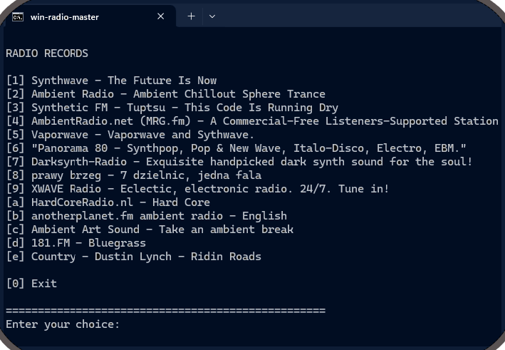

# 🎧 win-radio-master

A simple Windows (x32/x64) command-line script for recording internet radio streams — powered by [**streamripper**](https://github.com/streamripper/streamripper).  

<p align="left">
  
</p>

> [!WARNING]
> ⚠️ Use this script **only** for downloading content *not protected by copyright*.

---

## 🚀 Features
- Works on both **Windows x32/x64**
- Uses **streamripper** for downloading radio streams
- Saves configuration automatically to `%userprofile%\radio_save_dir`
- Supports adding custom radio stations

---

## 🧭 How to Use

### 1️⃣ Clone the repository
```bash
git clone https://github.com/Avidei/win-radio-master.git
cd win-radio-master
```

### 2️⃣ Run the script
```bash
Double-click win-radio-master.bat
```

### 3️⃣ Configure and record

* Choose a directory to save streams (config is stored in `%userprofile%\radio_save_dir`)  
  → Delete this config if any issue occurs and rerun the script

* If you don’t have **streamripper**, the script will open its download page

* Close Command Prompt, download and install `streamripper-windows-installer-{any_version}.exe`

* Rerun the script and select a radio station  
  → It will open in your default browser and start recording automatically

* To stop the program — just close the Command Prompt window


## 🧩 Add Custom Radio Stations

> [!NOTE]  
> To add a new radio station, edit your `.bat` file:
> ```batch
> ::TITLE
> echo [{symbol}] {name of radiostation}
>
> ::CHECK
> Add {symbol} to the end of section
>
> ::URL
> IF %startradio%=={symbol} SET url={radiostation_url}
> ```


## ⚠️ Known Issues

### ❌ `error -6`
```text
error -6 [SR_ERROR_CANT_RESOLVE_HOSTNAME]
bye..
shutting down
```

This problem is caused by the user-agent. <br>
If you use for instance VLC ("VLC/2.2.6 LibVLC/2.2.6"), the stream works

## 📜 License

This project is licensed under the [GNU General Public License v3.0](https://www.gnu.org/licenses/gpl-3.0.html).


